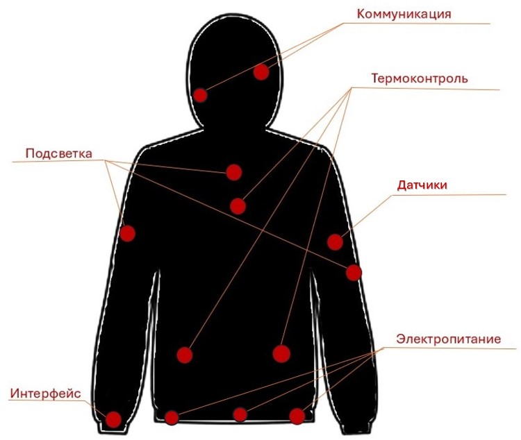

# Smart Clothes

# Описание
Устройство состоит из шести встраиваемых систем представленных на рисунке.
### Коммуникации
  1. Динамики (наушники)
  2. Микрофон
  3. Камера
### Электропитание 
  1. Аккумуляторная сборка на поясе
  2. Порты выводов питания (USB, Type-C)
### Подсветка
  1. Матричная сборка RGB-светодиодов
### Датчики
  1. Пульсометр
  2. Пульсоксиметр
  3. Термометр
  4. Тонометр
### Термоконтороль
  1. Нагревательные элементы
  2. Охлаждающие элементы
  3. Датчики температуры
  4. Устройство циркуляции воздуха
### Интерфейс
  1. Устройство ввода/вывода и котроля систем (микроконтроллер)
 

# Источники вдохновения
* https://www.youtube.com/watch?v=G9ADVeNpypk

* https://www.ozon.ru/seller/piks-sng-23055/products/?miniapp=seller_23055

* https://vc.ru/u/924811-mila-ulybina/401736-odezhda-s-vstroennoy-elektronikoy-sozdannaya-mega-brendami-s-2000-po-2022-god

* https://shellzine.net/levis-icd/

* https://kit-e.ru/elektronika-vstroennaya-v-odezhdu-tehnologii-i-perspektivy-chast-1/

* https://habr.com/ru/articles/455126/

* https://www.mvideo.ru/blog/pomogaem-razobratsya/umnoj-odezhdy-chto-kupit

* https://www.nature.com/articles/s41586-018-0390-x

* https://indicator.ru/engineering-science/vpletennye-v-tkan-provoda-09-08-2018.htm

* https://www.diodmag.ru/aboutdiods/277-kurtka-so-svetodiodami-povysit-vashu-bezopasnost-v-temnoe-vremya-sutok.html

* https://tvspb.ru/news/2016/10/25/inzhenernaya-magiya-magistrant-itmo-sozdal-kurtku-hameleon
